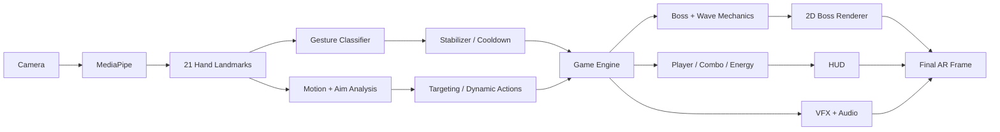

# Developer Boss Fight


**A real-time AR computer-vision boss fight controlled entirely by hand gestures.**

Developer Boss Fight turns webcam hand tracking into an actual combat loop: defend with a Firewall, aim a Debug Blaster with your index finger, throw Force Punches using motion velocity, grab bosses with a Pinch gesture, and unlock an Ultimate after three successful defensive blocks.

> Built with Python, OpenCV, MediaPipe Hand Landmarker, NumPy, sprite animation, state machines, VFX, and audio feedback.

## Why this project is different

This is not just "MediaPipe + effects." The system treats hand landmarks as **game input** and combines static geometry with temporal behavior:

- precise multi-joint pointing
- PINCH vs FIST disambiguation
- velocity-gated dynamic punch detection
- target/weak-point ray intersection
- gesture stabilization and cooldowns
- boss/player state machines
- wave-specific mechanics

## Gameplay

| Gesture | Action | Gameplay role |
|---|---|---|
| ✋ Open Palm | Firewall Shield | blocks incoming boss attacks |
| ☝️ Pointing | Debug Blaster | aims at boss / weak points |
| 👊 Fist + fast motion | Force Punch | speed-gated heavy attack |
| 🤏 Pinch | Gravity Claw | grabs and moves the boss |
| 🙌 Both hands open | Deploy Ultimate | available at 100% Deploy Energy |

### Deploy Energy

The Ultimate cannot be charged by spamming attacks:

```text
Successful Firewall Block #1 → ~33%
Successful Firewall Block #2 → ~66%
Successful Firewall Block #3 → 100% → ULTIMATE READY
```

## Boss waves

| Wave | Boss | HP | Mechanic |
|---|---|---:|---|
| 1 | BUG — Level 99 | 100 | baseline combat |
| 2 | MEMORY LEAK — Level 120 | 150 | regenerates after 2 s without damage |
| 3 | DEPENDENCY HELL — Level 150 | 200 | standard combat in V2.5 |
| 4 | PRODUCTION BUG — Level 999 | 300 | Rage Mode below 50% HP |

## Real-time pipeline



## Hard CV problem: PINCH vs FIST

These two gestures overlap strongly in landmark geometry. A naive "folded fingers = fist" rule misclassifies natural pinches.

V2.5 combines:

- normalized Thumb Tip ↔ Index Tip distance
- index joint bend geometry
- strict compact-fist rejection
- FIST-specific thumb-to-palm geometry
- classifier priority (PINCH before FIST)
- temporal stabilization across recent frames

See [Computer Vision documentation](docs/COMPUTER_VISION.md) for the full reasoning.

## Precise pointing

The aim ray uses multiple index-finger segments instead of only PIP → TIP:

```text
MCP → PIP → DIP → TIP
```

The direction is temporally smoothed before ray/weak-point intersection, so the visible ray follows the fingertip more naturally.

## Boss attack readability

Boss attacks are explicitly telegraphed:

```text
BOSS CHARGING...
      ↓
Energy Orb
      ↓
Launch + Trail + Sparks
      ↓
INCOMING ATTACK
      ↓
✋ Firewall Block   OR   Player Hit
```

## Installation

### Windows quick setup

Recommended: **Python 3.12**.

```bat
setup_windows.bat
```

Or manually:

```bat
py -3.12 -m venv .venv
.venv\Scripts\activate
python -m pip install --upgrade pip
pip install -r requirements.txt
```

## Run

```bat
python main.py
```

The official MediaPipe Hand Landmarker model is downloaded automatically on first run.

### Keyboard controls

| Key | Action |
|---|---|
| `Q` | Quit |
| `R` | Reset run |
| `D` | Toggle MediaPipe landmarks |
| `M` | Toggle sound |

## Tests

```bash
python -m compileall -q main.py src tests
python -m unittest discover -s tests -v
```

## Repository structure

```text
.
├── main.py
├── config/
│   ├── bosses.json
│   └── waves.json
├── assets/
│   ├── bosses/
│   └── sounds/
├── src/
│   ├── core/
│   ├── gameplay/
│   ├── rendering/
│   ├── camera.py
│   ├── hand_tracker.py
│   ├── gesture_classifier.py
│   ├── gesture_stabilizer.py
│   ├── game_state.py
│   ├── vfx.py
│   ├── hud.py
│   └── audio.py
├── tests/
├── docs/
└── .github/
```

## Documentation

- [Full Project Documentation](docs/PROJECT_DOCUMENTATION.md)
- [Arabic Project Documentation](docs/PROJECT_DOCUMENTATION_AR.md)
- [Architecture](docs/ARCHITECTURE.md)
- [Computer Vision & Gestures](docs/COMPUTER_VISION.md)
- [Gameplay Design](docs/GAMEPLAY.md)
- [Testing](docs/TESTING.md)
- [Roadmap](docs/ROADMAP.md)
- [How to Publish to GitHub](docs/GITHUB_PUBLISHING.md)
- [Changelog](CHANGELOG.md)

## GitHub topics

`computer-vision` `opencv` `mediapipe` `python` `augmented-reality` `gesture-recognition` `hand-tracking` `game-development` `human-computer-interaction` `vfx`

## Privacy

Webcam processing is local. The project does not intentionally upload camera frames or hand landmarks. See [SECURITY.md](SECURITY.md).

## License

Source code is released under the MIT License. Review [ASSETS_NOTICE.md](ASSETS_NOTICE.md) before redistributing visual/audio assets.
