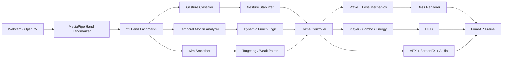

# Architecture

Developer Boss Fight is organized as a real-time perception → interpretation → game-state → rendering pipeline.

## Runtime layers

### 1. Capture
`src/camera.py` owns camera creation, frame acquisition, mirroring, and cleanup.

### 2. Hand perception
`src/hand_tracker.py` wraps MediaPipe Hand Landmarker and returns 21 normalized landmarks per hand.

### 3. Gesture interpretation
`src/gesture_classifier.py` performs geometry-based static gesture classification. `src/gesture_stabilizer.py` reduces frame-to-frame jitter and converts stable changes into one-shot events.

### 4. Temporal interaction
`src/gameplay/motion.py` estimates hand velocity for dynamic punch detection. `src/gameplay/aiming.py` smooths pointing direction using several joints and multiple recent frames.

### 5. Targeting
`src/gameplay/targeting.py` performs ray-style aiming against boss hitboxes and weak points.

### 6. Game state
`src/game_state.py` orchestrates player HP, score, combo, energy, waves, boss damage, and attack resolution. The finite-state machine lives under `src/core/`.

### 7. Boss mechanics
`src/gameplay/boss_mechanics.py` implements wave-specific behavior such as Memory Leak regeneration and Production Bug Rage.

### 8. Rendering
`src/rendering/` handles animated boss sprites, AR weapons, screen effects, and target feedback. `src/vfx.py` contains attack-specific VFX.

### 9. Audio
`src/audio.py` provides lightweight asynchronous sound feedback on Windows.

## Data ownership

A central design goal is to avoid hidden coupling:

- CV modules do not directly change boss HP.
- Rendering modules do not decide whether damage is valid.
- Boss configuration stays in JSON under `config/`.
- Gameplay events are resolved before visual feedback is rendered.

## Performance strategy

The application favors a synchronous loop because the current workload is small enough to keep behavior deterministic. Expensive VFX should use local regions rather than full-frame operations. Async capture/GPU rendering should only be introduced after profiling identifies a real bottleneck.
