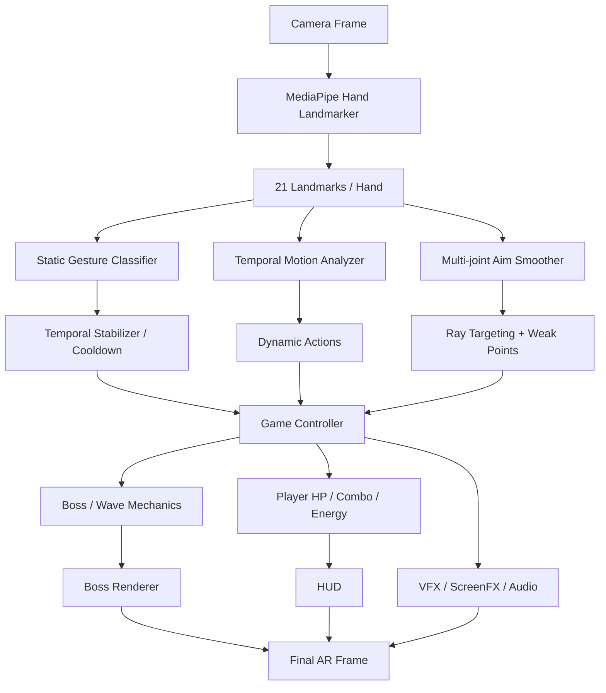

# Developer Boss Fight — Project Documentation

## 1. Executive Summary

**Developer Boss Fight** is a real-time augmented-reality computer-vision game where a player fights software-themed bosses using hand gestures captured by a normal webcam. The project combines MediaPipe hand tracking, geometric gesture recognition, temporal motion analysis, game-state management, 2D sprite animation, AR weapons, VFX, audio feedback, and boss-specific mechanics in a single Python/OpenCV runtime.

The project began as a hand-gesture demo and evolved into a small interaction engine. The central engineering goal is not merely to recognize poses, but to map perception into gameplay actions that feel intentional: a palm is raised because an attack must be blocked; a pointing finger becomes a precise aiming device; a fist only attacks when it moves with sufficient velocity; a pinch manipulates the boss; and the Ultimate is earned by successfully defending three times.

## 2. Technical Stack

- **Python 3.12** — application language
- **OpenCV** — camera capture, HUD, compositing, VFX, final display
- **MediaPipe Hand Landmarker** — real-time 21-landmark hand tracking
- **NumPy** — geometry, vectors, image operations
- **JSON configuration** — boss and wave definitions
- **Python `unittest`** — automated validation

No separate deep-learning gesture model is required in the current version. Gesture classification is geometric and explainable.

## 3. System Pipeline



Every webcam frame passes through the complete loop. The CV layer produces intent; the game layer decides what is valid; the renderer visualizes the result.

## 4. Gesture Engineering

### Open Palm → Firewall

The classifier checks extended-finger geometry. During an incoming projectile, an open palm represents an active defense. A successful block preserves Player HP and increments Deploy Energy.

### Pointing → Debug Blaster

Pointing requires an extended index and folded remaining fingers. The aiming subsystem does not use only a single line segment. It combines:

```text
MCP → PIP → DIP → TIP
```

with higher weight on distal segments and temporal smoothing across recent frames. This produces a ray that visually follows the fingertip and supports boss/weak-point intersection tests.

### Fist + velocity → Force Punch

A static fist only prepares the Force Gauntlet. Attack activation additionally requires hand motion above a velocity threshold. This avoids treating a held fist as repeated attacks and introduces a temporal CV feature.

### Pinch → Gravity Claw

Pinch classification was one of the hardest problems in the project because PINCH and FIST both produce folded fingers and a compact hand silhouette.

The solution combines:

- normalized thumb-tip ↔ index-tip distance
- index joint bend angle
- strict compact-fist rejection
- FIST-specific thumb-to-palm geometry
- classifier priority (PINCH before FIST)
- temporal stabilization

The key design choice is normalization. A fixed pixel threshold breaks as the player moves toward or away from the camera. Dividing by palm scale makes the feature more stable across distance.

## 5. Temporal Stabilization

Raw per-frame classification is noisy. A real-time camera may produce sequences such as:

```text
FIST, FIST, NONE, FIST, FIST, ...
```

The stabilizer maintains recent observations and only emits a gameplay event when a gesture is sufficiently stable. Cooldowns then prevent a held pose from firing at camera frame rate.

This layer is essential because game input must be more stable than perception output.

## 6. Combat Model

The player and boss both have HP. The boss periodically charges and launches a readable energy projectile.

```text
BOSS CHARGING → ENERGY ORB → PROJECTILE TRAIL → IMPACT
```

At impact:

- active Open Palm → Firewall block
- no Firewall → Player HP damage + damage VFX

This creates a real offense/defense loop rather than a one-sided target demo.

## 7. Deploy Energy and Ultimate

V2.5 intentionally ties Ultimate charge to defense:

| Successful blocks | Deploy Energy |
|---:|---:|
| 0 | 0% |
| 1 | ~33% |
| 2 | ~66% |
| 3 | 100% |

Normal attacks do not charge the meter. At 100%, two simultaneous open palms trigger **Deploy to Production**, after which the meter resets.

This mechanic creates a meaningful reason to use the shield and balances offensive play.

## 8. Boss and Wave Design

### Wave 1 — BUG, Level 99

A 100 HP baseline boss used to establish the combat loop.

### Wave 2 — MEMORY LEAK, Level 120

150 HP. If the player stops dealing damage for 2 seconds, the boss regenerates +5 HP every 0.5 seconds. This forces sustained pressure and gives the boss name a developer-themed gameplay meaning.

### Wave 3 — DEPENDENCY HELL, Level 150

200 HP. In the current V2.5 build it uses standard combat. An earlier shield/gesture-sequence mechanic was intentionally removed because the visual/interaction feedback was not strong enough yet.

### Wave 4 — PRODUCTION BUG, Level 999

300 HP. At 50% HP it enters Rage Mode. Attack cadence becomes dramatically faster and projectile travel time drops, accompanied by explicit HUD and glitch feedback.

## 9. Rendering and Feedback

The rendering system includes:

- 2D boss frame-sequence animation
- AR weapon overlays
- Firewall geometry and impact ripples
- Debug Blaster ray and target reticle
- Force Gauntlet glow
- Gravity Claw tether
- Ultimate portal-style effect
- boss hit flash and knockback
- screen shake
- critical flash
- red damage tint
- Rage glitch
- HUD for HP, waves, combo, score, energy, and state

Good feedback is treated as part of interaction accuracy. If the player cannot see why an action succeeded or failed, technically correct recognition still feels wrong.

## 10. Configuration-Driven Bosses

Boss definitions live in `config/bosses.json` and wave ordering lives in `config/waves.json`. This prevents boss values from being scattered through rendering/game code and makes future content easier to add.

Example:

```json
{
  "id": "memory_leak_120",
  "name": "MEMORY LEAK",
  "level": 120,
  "max_hp": 150,
  "mechanic": "regen"
}
```

## 11. Software Architecture Principles

The codebase follows several practical separation rules:

1. **Perception does not directly mutate game state.**
2. **Rendering does not decide damage validity.**
3. **Boss/wave data is configuration-driven.**
4. **Dynamic gestures use time-series information.**
5. **Debug visualization can be disabled for user-facing footage.**
6. **Performance improvements are guided by profiling rather than premature threading.**

## 12. Testing Strategy

Automated tests validate deterministic logic such as:

- FSM/game core
- Player HP
- hand motion speed
- combo behavior
- Deploy Energy
- aim smoothing
- Memory Leak regeneration
- current boss configuration

Camera-dependent recognition additionally requires manual testing because lighting, hand pose, field of view, and occlusion materially affect landmarks.

## 13. Key Engineering Challenges

### A. PINCH vs FIST ambiguity

This was a real classification problem, not a visual polish issue. Both classes occupy overlapping geometric space. The final rule uses normalized distance, multiple finger conditions, evaluation priority, and stabilization instead of a single boolean finger-state rule.

### B. Pointing precision

A single finger segment generated noisy aim. Multi-joint direction plus temporal smoothing improved both technical targeting and visual credibility.

### C. Making boss attacks readable

A small projectile was technically sufficient but visually unclear in social-video footage. The attack was redesigned as a telegraphed charge, glowing orb, trail, sparks, and impact response. This illustrates a broader HCI principle: interaction must be perceivable, not merely correct internally.

### D. Distinct boss mechanics

Boss differentiation needs more than HP scaling. Memory Leak regeneration and Production Bug Rage alter player strategy and make the developer-themed naming meaningful.

## 14. Controls

| Key | Function |
|---|---|
| `Q` | Quit |
| `R` | Reset run |
| `D` | Toggle MediaPipe landmarks |
| `M` | Toggle sound |

## 15. Future Work

The strongest next improvements are:

- optional calibration per user
- gesture confidence scores
- Z/depth-aware punch velocity
- learned temporal gesture classifier
- higher-quality boss/weapon animation packs
- cross-platform audio backend
- shader-based distortion/glow if profiling shows OpenCV VFX is the bottleneck
- packaged desktop release

## 16. Portfolio Value

The project demonstrates more than model inference. It combines:

- real-time CV
- geometric reasoning
- temporal signal processing
- HCI / gesture design
- state machines
- data-driven game systems
- 2D animation
- VFX and audio feedback
- testing and software architecture

That combination is what turns a webcam gesture experiment into an interactive computer-vision system.
